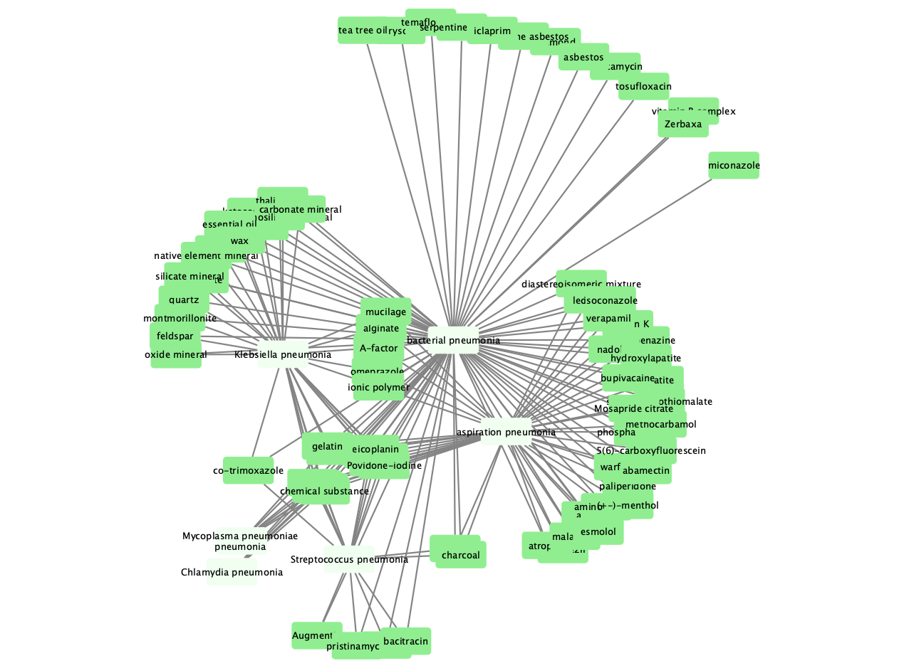

- Incubation project for concept associations in biomedical literature
- Concepts are collected from biomedical ontologies


### Example command lines

```bash

python setup.py install

wget ftp://ftp.ebi.ac.uk/pub/databases/chebi/ontology/chebi_lite.obo
wget http://purl.obolibrary.org/obo/doid.obo

./scripts/biolit findpairs chebi_lite.obo CHEBI:59999 doid.obo DOID:874 > c59999-d874.json

./scripts/biolit index c59999-d874.json
#documents indexed: 183

./scripts/biolit cyview c59999-d874.json

```
[Concept pairs for the example search](docs/chebi59999-do874.json)



### Literature indexes

PMC and PubMed articles were indexed with using the scripts of the [`nosql-biosets`](
https://bitbucket.org/hspsdb/nosql-biosets/src/master/nosqlbiosets/pubmed/) project

For development, we use a non public Elasticsearch server for PMC and PubMed queries.
After you index PMC and PubMed articles with your Elasticsearch server update the
Elasticsearch URL in `biolit/esquery.py` file to point the queries to your server.

#### Indexing PubMed articles with their Pubtator annotations

Note: This is a recent work in its early stages.

Following example command line indexes PubMed XML files in the folder 
/data/pubmed/, with the index name pubmed-2021

```bash
 
python ./biolit/esindex.py index-pubmed /data/pubmed/\
	 pubmed-2021 --host localhost

```
